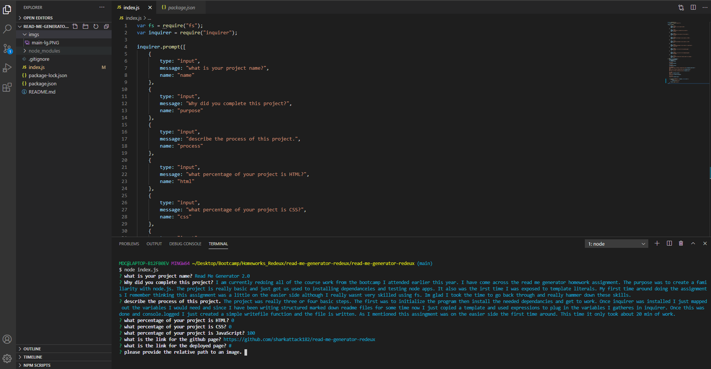

# Read Me Generator 2.0

## Purpose
I am currently redoing all of the course work from the bootcamp I attended earlier this year. I have come across the read me generator homework assignment. The purpose was to create a familiarity with node.js. The project is really basic and just got us used to installing dependanceies and testing node apps. It also was the irst time I was exposed to template literals. My first time around doing the assignments I remember thinking this assignment was a little on the easier side although I really wasnt very skilled using fs. Im glad I took the time to go back through and really hammer down these skills.

## Process
The project was really three or four basic steps. The first was to initialize the program then install the needed dependancies and get to work. Once inquirer was installed I just mapped out the variables I would need and since I have been writing structured marked down readme files for some time now I just copied a template and used expressions to plug in the variables I gatheres in inquirer. Once this was done and console.logged I just created a simple writefile function and the file is written. As I mentioned this assingment was on the easier side the first time around. This time it only took about 20 min of work. 

## Languages 
JavaScript 
 
HTML 
 
CSS 

## Links
[GitHub](https://github.com/sharkattack182/read-me-generator-redeux)
 
To download this file please click the green code button above.

## Visuals
